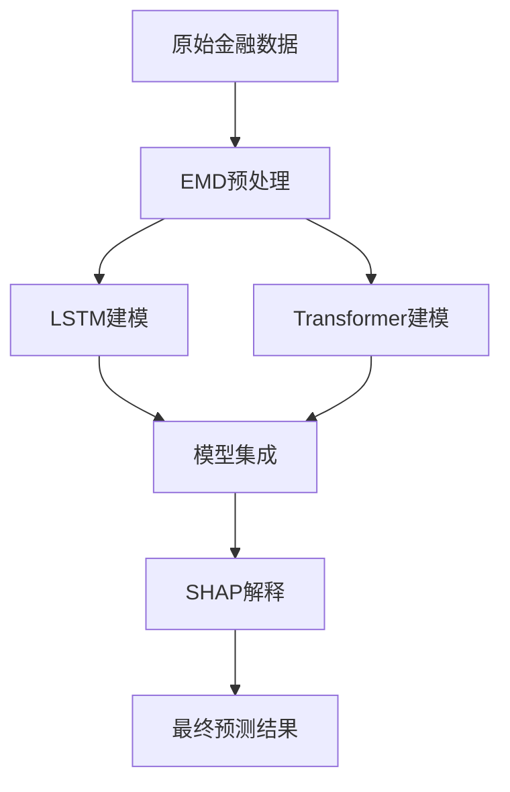

# AI金融预测知识点分析：本质特点与形象比喻

> 本文档深入分析AI金融预测项目中的核心技术，通过本质特点和形象比喻帮助理解每个知识点的核心价值。

## 📋 目录

1. [LSTM长短期记忆网络](#1-lstm长短期记忆网络)
2. [Transformer中的Attention机制](#2-transformer中的attention机制)
3. [SHAP可解释性分析](#3-shap可解释性分析)
4. [EMD经验模态分解](#4-emd经验模态分解)
5. [综合金融预测系统](#5-综合金融预测系统)
6. [技术对比总结](#6-技术对比总结)

---

## 1. LSTM长短期记忆网络

### 🔬 本质特点

LSTM（Long Short-Term Memory）是一种特殊的循环神经网络，具有以下核心特点：

- **门控机制架构**：通过遗忘门、输入门、输出门精确控制信息流
- **长期依赖学习**：有效解决传统RNN的梯度消失问题
- **序列记忆能力**：能够记住长期的时间序列模式和趋势
- **自适应遗忘**：智能决定哪些历史信息需要保留或丢弃

### 🎭 形象比喻

LSTM就像一个**精明的投资顾问**，他配备了三个得力助手：

- **🗑️ 遗忘门（忘事助手）**：帮他主动遗忘过时的、不重要的市场信息，避免被历史包袱拖累
- **📥 输入门（筛选助手）**：帮他从海量的新信息中筛选出真正有价值的市场信号
- **📤 输出门（决策助手）**：在关键时刻帮他决定应该输出什么样的预测建议

这样，即使面对瞬息万变的金融市场，这位投资顾问也能：
- 记住重要的历史模式（如2008年金融危机的教训）
- 忘记无关的短期噪声（如某天的异常交易）
- 在合适的时机给出精准的预测建议

### 💡 金融应用优势

- 捕捉股价的长期趋势变化
- 学习市场的周期性和季节性模式
- 处理非平稳的金融时间序列数据

---

## 2. Transformer中的Attention机制

### 🔬 本质特点

Attention机制是Transformer的核心，具有革命性的特点：

- **并行计算架构**：摆脱了RNN的串行限制，大幅提升计算效率
- **全局依赖建模**：能够直接建模序列中任意两个位置的关系
- **多头注意力**：从多个不同的子空间同时关注信息
- **自注意力机制**：Query、Key、Value都来自同一输入序列

### 🎭 形象比喻

Attention机制就像一个**全知全能的金融分析师**：

- **👁️ 千里眼能力**：他能同时"看到"所有历史数据点，不需要像普通人那样从头到尾逐一阅读
- **🧠 多重人格**：他拥有8个、16个甚至更多的"分身"（多头注意力），每个分身从不同角度分析市场
- **⚡ 瞬间聚焦**：面对复杂的市场信息，他能瞬间定位到最相关的部分

想象一下这个分析师在工作：
- **分身1**专注于技术指标之间的关系
- **分身2**关注宏观经济数据的影响
- **分身3**分析市场情绪的变化
- **分身4**追踪资金流向的模式

所有分身同时工作，最后汇总成一个全面而精准的市场分析报告。

### 💡 金融应用优势

- 识别复杂的特征间相互关系
- 提供可视化的注意力权重分析
- 高效处理多元金融时间序列

---

## 3. SHAP可解释性分析

### 🔬 本质特点

SHAP（SHapley Additive exPlanations）基于博弈论，具有严格的数学基础：

- **Shapley值理论**：源于合作博弈论，确保公平的贡献分配
- **一致性保证**：所有特征贡献之和等于预测值与基准值的差异
- **模型无关性**：适用于任何机器学习模型
- **局部和全局解释**：既能解释单个预测，也能分析整体模型行为

### 🎭 形象比喻

SHAP就像一个**公正严明的法官**，正在审理一个复杂的案件：

**🏛️ 法庭场景**：
- **案件**：为什么股价会涨到这个水平？
- **证人**：各种金融特征（RSI、MACD、成交量等）
- **任务**：精确计算每个"证人"对最终"判决"的贡献度

**⚖️ 审理过程**：
1. **公平原则**：使用博弈论确保每个特征得到公正的"功劳分配"
2. **详细取证**：分析每个特征在不同"联盟"（特征组合）中的表现
3. **量化贡献**：给出精确的数值化贡献度

**📋 最终判决**：
- "RSI指标对本次股价上涨贡献了+0.3元"
- "成交量放大贡献了+0.2元"  
- "宏观因素贡献了-0.1元"
- "技术面贡献了+0.15元"

这样，每个预测都有清晰的"证据链"和"责任归属"。

### 💡 金融应用优势

- 满足金融监管的可解释性要求
- 识别关键的风险驱动因子
- 提供投资决策的理由和依据

---

## 4. EMD经验模态分解

### 🔬 本质特点

EMD（Empirical Mode Decomposition）是一种自适应信号分解方法：

- **完全数据驱动**：不需要预设任何基函数或窗口函数
- **自适应分解**：根据数据本身的特性进行分解
- **多尺度分析**：将复杂信号分解为不同频率的IMF分量
- **时频局部化**：保持原始信号的时间特性

### 🎭 形象比喻

EMD就像一个**神奇的音响工程师**，拥有超凡的听觉分析能力：

**🎼 复杂交响乐场景**：
- **输入**：一首复杂的金融"交响乐"（价格时间序列）
- **挑战**：这首乐曲混合了多种乐器，听起来非常复杂

**🎵 神奇分离过程**：
1. **自动识别**：不需要事先知道有哪些乐器，就能"听出"不同的声音层次
2. **精确分离**：
   - 🎻 **小提琴高音**（高频IMF）→ 短期市场噪声和日内波动
   - 🎺 **中音号**（中频IMF）→ 中期趋势和季节性模式
   - 🎻 **大提琴低音**（低频IMF）→ 长期趋势和周期
   - 📯 **低音提琴**（残余项）→ 基本的价值趋势

**🔄 自适应调整**：
- 如果乐曲中途变化（市场制度转换），工程师能自动调整分离策略
- 每个"乐器声部"都保持完整的时间连续性

**🎯 最终成果**：
把一个混乱的市场信号变成清晰分层的"音乐谱"，让我们能分别分析不同时间尺度的市场行为。

### 💡 金融应用优势

- 有效去除市场噪声
- 分离不同时间尺度的市场成分
- 识别市场的内在周期性模式

---

## 5. 综合金融预测系统

### 🔬 本质特点

综合系统整合了多种AI技术，形成端到端的预测框架：

- **模块化设计**：每个技术模块各司其职，协同工作
- **多层次分析**：从数据预处理到模型解释的完整链条
- **集成学习**：结合多个模型的优势，提高预测稳定性
- **可解释性**：提供透明的决策过程和风险分析

### 🎭 形象比喻

综合系统就像一个**超级智能投资银行**，内部有多个高度专业化的部门：

**🏢 投资银行组织架构**：

1. **🧹 数据清洗部（EMD）**：
   - **职责**：从嘈杂的市场信息中提取有用信号
   - **工作方式**：像筛金子一样，将原始数据分解成不同纯度的"金沙"
   - **输出**：干净的、分层的市场信息

2. **📈 时序分析部（LSTM）**：
   - **职责**：专门分析历史趋势和长期模式
   - **工作方式**：像经验丰富的老交易员，善于从历史中学习
   - **输出**：基于历史模式的趋势预测

3. **⚡ 全局分析部（Transformer）**：
   - **职责**：快速理解所有相关因素的复杂关系
   - **工作方式**：像拥有"上帝视角"的超级分析师
   - **输出**：全局优化的市场预测

4. **⚖️ 风控合规部（SHAP）**：
   - **职责**：解释每个决策的理由，评估风险因子
   - **工作方式**：像严格的内控部门，要求每个决策都有据可查
   - **输出**：详细的决策解释报告和风险分析

**🤝 协作流程**：
```
原始数据 → 数据清洗部 → 分析部门并行处理 → 风控部审核 → 最终投资建议
```

**🎯 最终成果**：
一个既强大又透明的AI投资决策系统，既能抓住市场机会，又能控制投资风险，还能向监管部门和客户解释每个决策的合理性。

### 💡 系统优势

- 技术互补，提高预测准确性
- 全流程可追溯和可解释
- 满足实际业务和监管需求

---

## 6. 技术对比总结

### 📊 核心特征对比表

| 技术 | 主要应用场景 | 核心优势 | 最佳比喻 | 适用数据类型 |
|------|-------------|----------|----------|-------------|
| **LSTM** | 序列预测建模 | 长期记忆能力 | 经验丰富的投资顾问 | 单变量时间序列 |
| **Transformer** | 复杂关系建模 | 全局并行计算 | 全知全能的分析师 | 多变量时间序列 |
| **SHAP** | 模型解释分析 | 公平特征归因 | 公正严明的法官 | 任何结构化数据 |
| **EMD** | 信号预处理 | 自适应分解 | 神奇的音响工程师 | 非平稳时间序列 |

### 🔄 技术协同关系



### 🎯 选择建议

**根据具体需求选择技术组合：**

1. **🚀 追求高准确性**：LSTM + Transformer + 集成学习
2. **🔍 需要可解释性**：任何模型 + SHAP分析
3. **📊 数据质量问题**：EMD预处理 + 后续建模
4. **⚖️ 监管合规要求**：全套技术组合，重点强化SHAP
5. **💰 计算资源有限**：EMD + LSTM的简化组合

### 🌟 未来发展方向

- **技术融合**：开发EMD-LSTM、Attention-SHAP等混合架构
- **实时化**：构建在线学习和实时预测系统
- **多模态**：集成文本、图像等多种数据源
- **自动化**：开发自动特征工程和模型选择系统

---

## 📝 总结

本项目展示的四种AI技术各有所长，相互补充：

- **EMD**负责"净化"数据，提取有效信号
- **LSTM**专注"记忆"历史，预测趋势  
- **Transformer**实现"全局"分析，并行高效
- **SHAP**提供"透明"解释，确保可信

它们的完美结合，为金融预测领域提供了一个既强大又可靠的AI解决方案，既能在复杂的市场环境中捕捉机会，又能满足现代金融业对透明度和可解释性的严格要求。

---

*本文档为AI金融预测项目的技术分析总结，旨在通过生动的比喻帮助读者理解复杂的AI技术原理。*